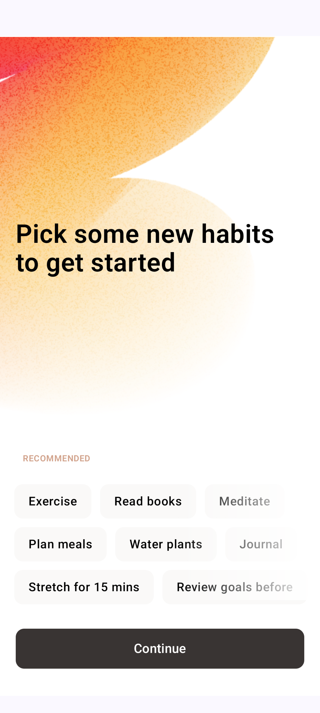

# 📋 ToDoList (Clean Architecture + MVI + Hilt + Jetpack Compose)

**ToDoList** is a modern, Kotlin-based Android application for managing daily tasks with a sleek and responsive UI built using **Jetpack Compose**. It allows users to add, delete, and mark tasks as completed. Tasks are organized into three tabs: `All`, `Active`, and `Completed`. A first-time onboarding screen helps users get started. The app follows the **MVI (Model–View–Intent)** architectural pattern along with **Clean Architecture** and **Hilt** for scalable, testable, and maintainable development.

---

## 📸 Screenshots

| Onboarding Screen | Home - All Tasks | Active Tasks | Completed Tasks |
|-------------------|------------------|--------------|------------------|
|  |  |  |  |

---

## 📱 Key Screens & Features

- **Onboarding Screen**
  - Displays helpful habits for first-time users
- **Home Screen**
  - Three tabs:  
    - `All`: View all tasks  
    - `Active`: View incomplete tasks  
    - `Completed`: View completed tasks
- **Task Management**
  - Add tasks via input field
  - Mark tasks as completed
  - Swipe to delete
- **Reactive State Handling**
  - Real-time updates using `StateFlow`
- **Modern UI**
  - Built with Jetpack Compose and Material Design 3

---

## 🧠 Technologies Used

| Technology | Purpose |
|------------|---------|
| **Kotlin** | Core programming language |
| **Jetpack Compose** | Declarative UI framework |
| **MVI Architecture** | Unidirectional data flow using Model-View-Intent |
| **Clean Architecture** | Separation of concerns (UI, Domain, Data) |
| **Hilt** | Dependency injection |
| **StateFlow** | Reactive state management |
| **Material Design 3** | Consistent, modern UI components |
| **Navigation Component** | Navigation between screens |

---

## ⚙️ Core Features

✅ Add, delete, and complete tasks  
✅ Organize tasks into tabs: All / Active / Completed  
✅ Swipe-to-delete gesture  
✅ First-time user onboarding screen  
✅ Reactive UI with `StateFlow`  
✅ Modern, responsive UI with Jetpack Compose  

---

## 🧱 Project Architecture

### 🧩 Clean Architecture + MVI

#### 1️⃣ UI Layer
- **Screens/Composables**: `HomeScreen`, `OnboardingScreen`, `TodoItem`, etc.
- **ViewModels**:  
  - `ActivityViewModel`, `TodoViewModel`, `OnboardingViewModel`
- **Intents**:  
  - User actions are represented by sealed classes: `ToDoIntent`, `OnboardingIntent`
- **StateFlow**:  
  - Each ViewModel exposes `StateFlow` to the UI

#### 2️⃣ Domain Layer
- Contains pure business logic
- **Use Cases**:
  - `IsFirstLaunchUseCase`, etc.
- No Android dependencies

#### 3️⃣ Data Layer *(Assumed)*
- Repositories for data sources like Room, SharedPreferences, or in-memory
- Mappers for converting between data and domain models

---

## 🔁 State Management (MVI Flow)

- **Intents**: User actions (e.g., AddTodo, DeleteTodo)
- **StateFlow**: Emitted by ViewModels as `ToDoState` (holds task list, input, loading/error states)
- **Reducer-like Updates**: UI reacts to state changes only through collected `StateFlow`
- **LaunchedEffect**: Used to trigger actions on screen load (e.g., fetch todos)

---


### 🛠 Setup

1. **Clone the Repository**
   ```bash
   git clone https://github.com/yourusername/todolist.git
   cd todolist
